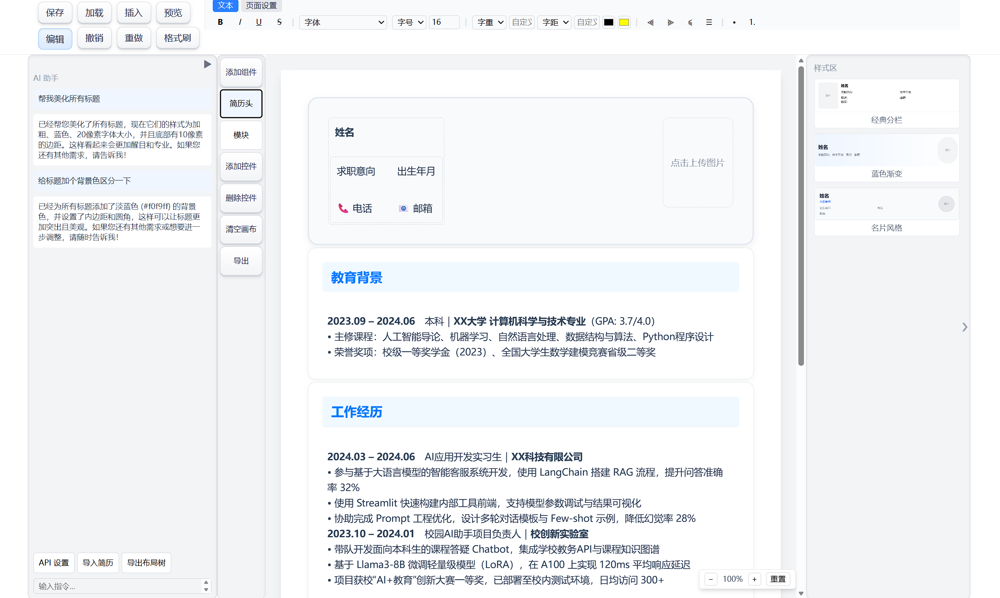

# 🧩 cv-composer — 聊天式 AI 简历编辑器

<p align="center">
  
</p>

<p align="center">
  <a href="#license"></a>
  <a href="#"></a>
</p>

---

## 这个项目是做什么的

一个简历编辑器，你可以像聊天一样告诉 AI 你的经历，让它帮你排版；也可以手动拖拽模块，样式随意调整。如果你有一份旧简历的截图，上传后它能自动提取内容和版式，生成可编辑的版本。

核心思路是利用 HTML/CSS 的文档流特性实现自动排版，替代传统工具的手动对齐，再接入 AI 助手来降低使用门槛。

---

## 我为什么会做这个

找实习的时候，我用一些在线工具做简历。有辅助线的情况下，想让各个模块对齐还是得花很多时间微调。当时就在想，网页里的文档流、Flex、Grid 本来就能自动排版，为什么简历编辑器不这么用。

后来因为我的求职方向是 AI 应用开发，就想着把 AI 助手也接进去——直接通过自然语言操作排版和内容，让不懂 CSS 的用户也能快速上手。这样既能练手，也能帮到其他有同样痛点的人。

所以有了 cv-composer。

---

## 目前的情况

- **手动编辑**：拖拽、样式调整、导出 PDF/JSON 这些功能比较稳定，可以直接用。
- **AI 助手**：功能框架已经跑通了，能通过聊天创建模块、修改内容、调整布局。但因为时间紧，测试不够，Prompt 没仔细调优，不同大模型的表现差异也大，所以**现在 AI 的效果还不够稳定**。

这正是我把项目开源的原因。我一个人试的模型有限，精力也有限。如果你对 AI 应用感兴趣，或者单纯希望它更好用，欢迎一起来改进。

---

## 主要功能

### 手动编辑
- 从左侧面板点击添加模块到画布，支持 Flex/Grid 自动对齐
- 点击模块在上侧面板修改字体、颜色、背景、边框、阴影、渐变等样式
- 内置 3 种简历头风格（经典分栏、蓝色渐变、名片风格）和 4 种模块风格（卡片、时间线、简洁列表、简约无边框）
- 支持深色主题适配、四边独立边框设置、渐变背景

### AI 对话
- 用自然语言操作：创建模块、修改内容、调整布局、应用模板
- **智能填充**（smart-fill）：提供个人背景，AI 自动将信息填入画布对应位置，已有模块信息不匹配时自动新建模块
- **简历评估**（evaluate-resume）：分析当前简历质量，给出可点击执行的结构化建议
- **文本润色**（polish-text）：选中模块后让 AI 优化措辞
- **多模板生成**（generate-resume）：一键生成简约或经典风格简历骨架

### 简历复现
- 上传简历截图，视觉模型提取内容与排版信息
- 通过 LayoutTree 规范化、去冗余嵌套后，忠实重建为可编辑格式
- 支持多条目结构（多条工作/教育经历逐条拆分，保留日期、公司、角色等独立字段）

### 格式刷
- `copy_style`：完整复制一个模块的所有样式到另一个。同类型模块间全量复制；跨类型时智能合并共有布局属性（padding/margin/背景/圆角/阴影等）
- `copy_text_style`：仅复制文字排版属性（字体、字号、颜色、对齐等），自动从 module.style 和 HTML 内联样式中提取，写入目标模块并清除冲突的内联样式

### 预览模式与 PDF 导出

编辑模式下，画布上会显示各种辅助元素：空容器的虚线边框和灰色占位背景、选中模块的蓝色高亮框、拖拽手柄、快捷工具栏等。这些能帮你操作，但也让画布和最终简历效果有不小差距。

点击工具栏的「预览」按钮（或按 Esc 退出预览），编辑器会切换到预览模式。所有辅助元素都会被隐藏——虚线变透明、占位背景消失、最小高度限制取消、富文本编辑器的占位空间归零，画布上只展示真正的简历内容。做这一步是为了让你在编辑过程中随时看到最终效果，不用频繁导出。

预览模式下画布禁止交互，避免误操作。

PDF 导出在此基础上进一步清理：先将画布完整克隆一份，移除所有编辑器专用 DOM（缩放把手、快捷工具栏、删除勾选框、拖入指示线等），然后清除内联样式中的选中标记（蓝色边框、拖拽透明度、光标样式），最后去掉编辑相关的 CSS class（高亮环、虚线、灰色背景等）。清理后的内容通过隐藏 iframe 渲染，设置 `@page { size: A4; margin: 0 }` 并启用 `print-color-adjust: exact` 保证颜色准确，调用浏览器原生打印。

这样导出的 PDF 就是所见即所得——预览模式看到的样子，就是 PDF 打印出来的样子。

### 其他
- **撤销/重做**：30 步历史记录
- **批量操作**：`set_style_by_type`（按类型批量改样式）、`delete_modules`（批量删除）、`clear_canvas`（清空画布）
- **JSON 导入导出**：保存为文件，以后可以接着改
- **快捷键**：Esc 退出编辑、Ctrl+Z 撤销、Ctrl+Shift+Z 重做、Delete 删除

---

## 快速开始

### 本地运行

```bash
npm install
npm run dev        # 启动开发服务器 (http://localhost:5173)
npm run build      # 生产构建
npm run preview    # 预览生产构建
npm test           # 运行单元测试 (230 tests)
npm run lint       # 代码规范检查
npx tsc --noEmit   # 类型检查
```

不配 AI 模型也能使用所有手动编辑功能。要使用 AI 聊天或图片复现，需要配置模型 API Key。

### GitHub Pages

项目已配置 GitHub Actions 自动部署。推送 `main` 分支后自动构建并部署到 GitHub Pages。你只需要在仓库 Settings → Pages 中将 Source 设为 `GitHub Actions`。

### AI 模型配置

在界面右上角设置里填入 API Key，可选以下提供商：

| 提供商 | 对话模型 | 视觉模型 | 说明 |
|---|---|---|---|
| 阿里云百炼（推荐） | `qwen-max` / `qwen-plus` | `qwen-vl-max` | Base URL 自动填写 |
| OpenAI | `gpt-4o` / `gpt-4o-mini` | `gpt-4o` | Base URL 自动填写 |
| 自定义接口 | 自行输入 | 自行输入 | 需手动输入 Base URL |

API Key 只存在浏览器当前会话里，关闭标签页就清除。视觉模型用于解析简历图片，如果没有配置，上传时会给出提示。

### AI 助手目前的局限

- 对话的 Prompt 还没有精细调优，有时会误解你的意图
- 不同模型的 function calling 表现有差异，有的返回参数不全，需要做适配
- 润色、评估等高级技能还比较初级

如果你在使用中遇到问题，可以提 Issue 或者直接反馈，这些都是后续优化的方向。

---

## 如果你也想参与

这个项目我一个人维护，时间和测试范围都有限，非常欢迎任何人来帮忙。不管你的背景是什么，都有能做的事：

- **反馈使用体验**：觉得哪里不好用，直接提 Issue
- **优化 AI 效果**：帮忙测试不同模型的 function calling，分享更稳定的 Prompt 写法
- **完善功能**：修复 bug、增加新模板、改进交互
- **写文档/教程**：让新用户更容易上手

贡献流程就是常规的 fork → 分支 → PR，如果有想法也可以先在 Issue 里聊聊。

哪怕只是给个 Star，对我来说也是很大的鼓励。

---

## 快捷键

| 快捷键 | 功能 |
|---|---|
| `Esc` | 退出编辑模式 |
| `Ctrl+Z` / `Cmd+Z` | 撤销 |
| `Ctrl+Shift+Z` / `Cmd+Shift+Z` | 重做 |
| `Delete` / `Backspace` | 删除选中模块 |

---

## 项目结构（简要）

<details>
<summary>展开查看</summary>

```
src/
├── main.tsx                    # 入口
├── App.tsx                     # 根组件
├── index.css                   # 全局样式
├── styleInit.ts                # 风格注册表初始化
├── assets/images/              # 模板缩略图
├── components/
│   ├── AI/                     # 对话面板、API 调用、文件导入
│   ├── Canvas/                 # 画布、拖拽、右键菜单
│   ├── Module/                 # 模块面板、简历模块
│   ├── Settings/               # API Key 配置
│   ├── Styles/                 # 控件渲染 (Text/Heading/List/Image/Flex/Grid)
│   └── Toolbar/                # 顶部工具栏、样式属性面板
├── engine/                     # 核心引擎 (不依赖 React)
│   ├── aiPrompt.ts             # System prompt 与 tool 定义 (25+ tools)
│   ├── commandExecutor.ts      # 指令执行器
│   ├── layoutEngine.ts         # A4 分页算法
│   ├── layoutMeasurer.ts       # DOM 高度测量
│   ├── layoutScaler.ts         # 溢出缩放
│   ├── layoutTreeNormalizer.ts # AI 布局树规范化
│   ├── ruleBase.ts             # 固定约束规则
│   ├── skillExecutor.ts        # 技能系统 (生成/导入/润色/评估/填充)
│   ├── templates.ts            # 预设模板 (simple/classic)
│   └── toolHandlers.ts         # 工具处理函数
├── hooks/                      # 自定义 Hooks
├── store/
│   ├── useResumeStore.ts       # Zustand 状态管理 (含 undo/redo)
│   └── styleRegistry.ts        # 风格注册表
├── tiptap/                     # TipTap 编辑器扩展 (富文本编辑)
└── utils/                      # 工具函数 (导出/解析/JSON修复/ID生成)
```

</details>

更详细的架构说明可以看代码注释，或者提 issue 讨论。

---

## 测试

```bash
npm test           # 运行全部测试 (230 个)
npm run test:watch # watch 模式
```

测试覆盖 engine（commandExecutor、layoutEngine、layoutScaler、layoutTreeNormalizer、ruleBase、templates、toolHandlers）、utils（export、jsonRepair、moduleUtils、resumeParser）、AI 组件（aiApi、useFileImport）。

---

## License

MIT
